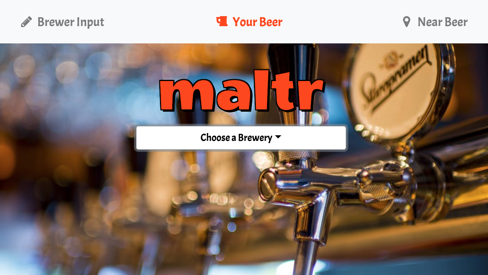
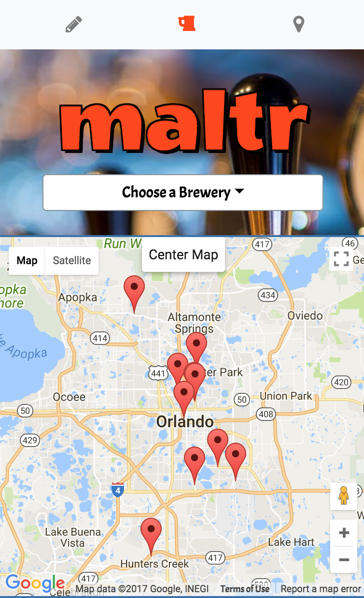
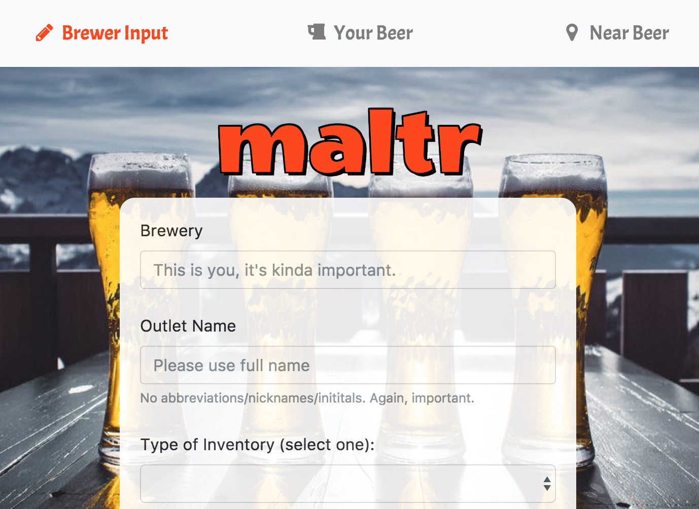

# Maltr.io

 Our app complements micro breweries' current marketing strategies by giving their clients a tool to search for additional local sellers of their favorite brews.

 Once subscribed, the brewers will have the opportunity to update their sellers' locations. These locations will populate on a map powered by Google Maps, along with a review of the establishment furnished by Google Reviews, enabling their clients to always know where they can find their favorite craft micro brew.

 You can visit the current build at [this link](https://drmulr.github.io/maltr/).

### Main Page
 Upon visiting the site, you'll have the opportunity to choose one of our partner breweries via a drop-down menu:

 

### Map Page
The application will then show locations that sell that particular brew on a Google Map, as input by the brewer:

### Brewer Page
As one of our partner breweries, we make it very simple to add your sale locations to the database:

